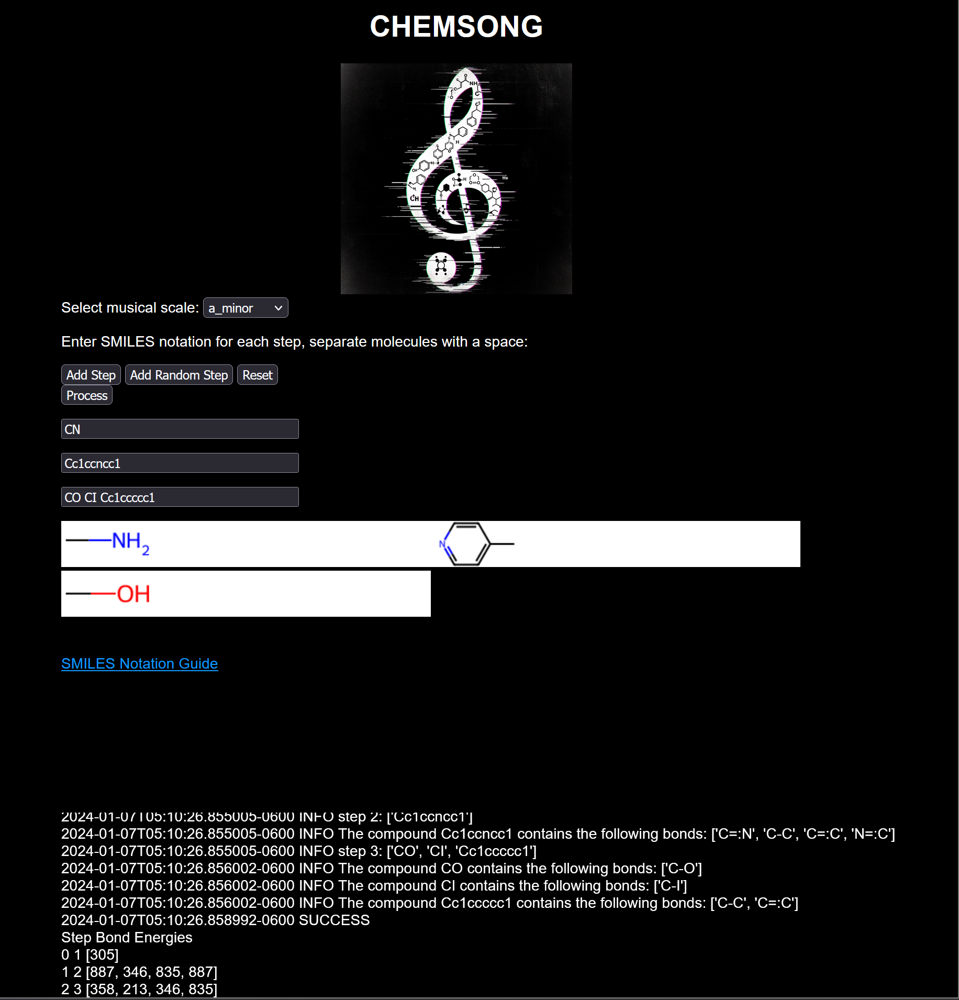
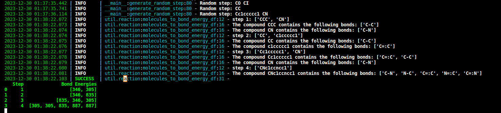

# Chemsong Web Application

## Overview

Map the energies of chemical bonds to musical scales.

## Features

- **Interactive Interface**: exists. Now a flask webapp.
- **Chemical Reaction Visualization**: Utilizes RDKit for  rendering molecular structures based on user input.
- **Audio Mapping of Bond Energies**: Converts chemical bond energies into musical notes for an auditory representation of reactions.

## Installation
To set up the Chemsong web application on your local machine, follow these steps using python >3.9.x, virtual environment reccomended.
1. Clone the repository:
`git clone github.com/benjaminagibbs/chemsong`
2. Install the required dependencies:
`pip install -r requirements.txt`
3. Run the application:
python application.py

note: production env will use gunicorn, ex:
`gunicorn -w 4 -b 0.0.0.0:8000 application:application`

## Usage(local)
1. Navigate to `localhost:5000` in your web browser.
2. Enter the SMILES notation for the desired chemical reaction or select 'generate random step'
3. Click 'Process' to visualize the reaction and hear the corresponding musical notes.

## Some background

### V0.2
This project was previously a ktinter application that ran locally on a linux box (see version 0.2 branch). To improve accessibility, the project has been recreated as a webapp which will be available via [www.electronopera.com](www.electronopera.com)

## Example cmd output:
The bond energies are transcribed from source: Data from J. E. Huheey, E. A. Keiter, and R. L. Keiter, Inorganic Chemistry, 4th ed. (1993)

Bond energy values are output using loguru in the command line, example:

## Current known errors:
- .png images not properly rendered, only first molecule in sequence showing

## Contributing

Contributions are highly encouraged, whether it's through enhancing audio mappings, improving visualizations, or introducing new features.

### Thanks to the following contributors for helping in early dev:
- Matt Fries: [moonpapasart.com](https://www.moonpapasart.com)
- Credit to Soundwoofer where I found this cool [reverb](https://soundwoofer.com/Component/Component/70af1a19-74dd-4e84-a9a8-b1147defa1c1)

## License

This project is open-sourced under the MIT License.
